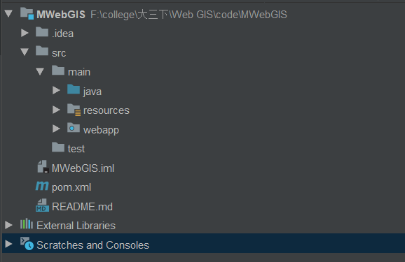
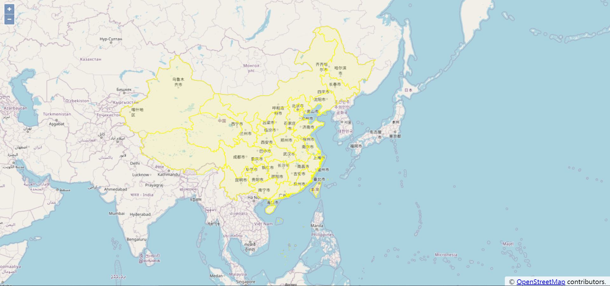

# shp数据入库、出库、可视化

今天给`npy`写了次作业，由于各种原因，不能用我用了很久的`SSM`或者`SpringBoot`框架，只用了最原始的`servlet`+`jsp`，然后我发现...自己已经不太会用了，写这个博客记录一下整套流程~

首先，作业的大致要求是将几何数据导入数据库，然后进行查询，使用地图可视化库进行可视化。因此，本次作业决定使用中国地图`shp`数据，导入`PostgreSQL`数据库，接着查询数据，最后使用`Openlayers`对查询到的数据进行可视化。

## 技术选型

`PostgreSQL` + `Servlet` + `jsp` + `Openlayers`

## 一 shp数据入库

首先使用命令行将`shp`数据转化为`sql`语句：

~~~cmd
shp2pgsql "shp路径" "数据库名"> "sql路径"
~~~

如：

~~~
shp2pgsql F:/BoundaryChn2_4p.shp boundary> F:/boundary.sql
~~~

然后在`pgadmin`中执行该`sql`文件即可。

## 二 搭建servlet程序

本次使用`maven`搭建`web`程序，文件结构如下：

**pom.xml**：

~~~xml
<?xml version="1.0" encoding="UTF-8"?>
<project xmlns="http://maven.apache.org/POM/4.0.0"
         xmlns:xsi="http://www.w3.org/2001/XMLSchema-instance"
         xsi:schemaLocation="http://maven.apache.org/POM/4.0.0 http://maven.apache.org/xsd/maven-4.0.0.xsd">
    <modelVersion>4.0.0</modelVersion>

    <groupId>com.tm</groupId>
    <artifactId>webgis</artifactId>
    <version>1.0-SNAPSHOT</version>
    <packaging>war</packaging>
    <dependencies>
        <dependency>
            <groupId>junit</groupId>
            <artifactId>junit</artifactId>
            <version>4.13</version>
            <scope>test</scope>
        </dependency>

        <dependency>
            <groupId>org.postgresql</groupId>
            <artifactId>postgresql</artifactId>
            <version>42.2.12</version>
        </dependency>

        <dependency>
            <groupId>javax.servlet</groupId>
            <artifactId>javax.servlet-api</artifactId>
            <version>4.0.1</version>
            <scope>provided</scope>
        </dependency>

        <dependency>
            <groupId>jstl</groupId>
            <artifactId>jstl</artifactId>
            <version>1.2</version>
        </dependency>
        <!--Tomcat引用-->
        <dependency>
            <groupId>org.apache.tomcat.embed</groupId>
            <artifactId>tomcat-embed-core</artifactId>
            <version>[9.0.20,)</version>
            <scope>provided</scope>
        </dependency>

    </dependencies>

    <build>
        <finalName>MWebgis</finalName>
        <plugins>
            <plugin>
                <groupId>org.apache.maven.plugins</groupId>
                <artifactId>maven-compiler-plugin</artifactId>
                <configuration>
                    <source>7</source>
                    <target>7</target>
                </configuration>
            </plugin>
        </plugins>
        <resources>
            <resource>
                <directory>src/main/java</directory>
                <includes>
                    <include>**/*.properties</include>
                    <include>**/*.xml</include>
                </includes>
                <filtering>true</filtering>
            </resource>
            <resource>
                <directory>src/main/resources</directory>
                <includes>
                    <include>**/*.properties</include>
                    <include>**/*.xml</include>
                </includes>
                <filtering>true</filtering>
            </resource>
        </resources>
    </build>
</project>
~~~

不赘述，文末有github链接，可自行查看。

## 三 数据库查询

1 数据库配置：

~~~properties
useSSL=false
verifyServerCertificate=false
url=jdbc:postgresql://ip:port/database
driver=org.postgresql.Driver
user=**** # 改成自己的
password=**** # 改成自己的
~~~

2 数据库链接类：

~~~java
public class DBHelper {

	static String url;
	static Properties pro = new Properties();
	static{

		InputStream in = DBHelper.class.getClassLoader().getResourceAsStream("config.properties");

		try {
			pro.load(in);
			url = pro.getProperty("url");
			String driver = pro.getProperty("driver");
			Class.forName(driver);
			System.out.println("驱动器加载成功");
		} catch (IOException e) {
			System.out.println("驱动器加载失败");
		} catch (ClassNotFoundException e) {
			System.out.println("驱动器加载失败");
		}
	}
	public static Connection getConnection() throws SQLException{
		//创建数据库连接
		Connection con = DriverManager.getConnection(url, pro);
		return con;
	}
}

~~~

3 数据库查询方法，返回为geojson：

~~~java
public String getBoundaryChn2PShp() {
        String result ="";
        String sql = "SELECT row_to_json(fc) FROM ( SELECT 'FeatureCollection' As type,array_to_json(array_agg(f)) As features FROM (SELECT 'Feature' As type, ST_AsGeoJSON(lg.geom)::json As geometry ,gid As properties FROM boundarychn2_4p As lg ) As f )  As fc";
        try (Connection conn = DBHelper.getConnection();

             PreparedStatement pstmt = conn.prepareStatement(sql);

             ResultSet rs = pstmt.executeQuery();) {

            if (rs.next()) {
               result = rs.getString(1);
            }
        } catch (SQLException e) {
            // TODO Auto-generated catch block
            e.printStackTrace();
        }
        return result;
    }
~~~

## 四 Openlayers数据可视化

1 index.js

~~~js
var image = new ol.style.Circle({
    radius: 5,
    fill: null,
    stroke: new ol.style.Stroke({color: 'red', width: 1})
});

var styles = {
    'Point': new ol.style.Style({
        image: image
    }),
    'LineString': new ol.style.Style({
        stroke: new ol.style.Stroke({
            color: 'green',
            width: 1
        })
    }),
    'MultiLineString': new ol.style.Style({
        stroke: new ol.style.Stroke({
            color: 'green',
            width: 1
        })
    }),
    'MultiPoint': new ol.style.Style({
        image: image
    }),
    'MultiPolygon': new ol.style.Style({
        stroke: new ol.style.Stroke({
            color: 'yellow',
            width: 1
        }),
        fill: new ol.style.Fill({
            color: 'rgba(255, 255, 0, 0.1)'
        })
    }),
    'Polygon': new ol.style.Style({
        stroke: new ol.style.Stroke({
            color: 'blue',
            lineDash: [4],
            width: 3
        }),
        fill: new ol.style.Fill({
            color: 'rgba(0, 0, 255, 0.1)'
        })
    }),
    'GeometryCollection': new ol.style.Style({
        stroke: new ol.style.Stroke({
            color: 'magenta',
            width: 2
        }),
        fill: new ol.style.Fill({
            color: 'magenta'
        }),
        image: new ol.style.Circle({
            radius: 10,
            fill: null,
            stroke: new ol.style.Stroke({
                color: 'magenta'
            })
        })
    }),
    'Circle': new ol.style.Style({
        stroke: new ol.style.Stroke({
            color: 'red',
            width: 2
        }),
        fill: new ol.style.Fill({
            color: 'rgba(255,0,0,0.2)'
        })
    })
};

var styleFunction = function(feature) {
    return styles[feature.getGeometry().getType()];
};

var geojsonObject = {};
$.ajax({
    type : 'post', //传输类型
    async : false, //同步执行
    url : 'shp', //web.xml中注册的Servlet的url-pattern
    dataType : 'json', //返回数据形式为json
    success : function(result) {
        geojsonObject = result
        var vectorSource = new ol.source.Vector({

            features: (new ol.format.GeoJSON()).readFeatures(geojsonObject,{
                featureProjection: 'EPSG:3857'
            })
        });

        var vectorLayer = new ol.layer.Vector({
            source: vectorSource,
            style: styleFunction
        });

        var map = new ol.Map({
            layers: [
                new ol.layer.Tile({
                    source: new ol.source.OSM()
                }),
                vectorLayer
            ],
            target: 'map',
            view: new ol.View({
                center: [116, 39],
                zoom: 4
            })
        });
    },
    error : function(errorMsg) {
        alert("加载数据失败");
    }
});
~~~

2 index.jsp

~~~jsp
<%@ page contentType="text/html;charset=UTF-8" language="java" %>
<%@taglib prefix="c" uri="http://java.sun.com/jsp/jstl/core" %>
<html>
<c:set var="path" value="${pageContext.request.contextPath }"/>
<head>
    <title>index</title>
    

    
</head>
<body>

<link rel="stylesheet" href="${path}/ol/ol.css">

</body>
</html>

~~~

## 五 效果

## 六 github

